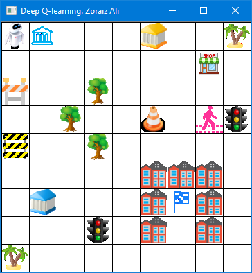

# DQN Research

This repository is a setup for testing Deep Q-Learning Algorithms.

## Robot environment

A minimalistic gym environment, where the goal is to walk the robot (left top), to the flag (surrounded by buildings).
An agent can move up, down, left, right or stay at the same position.

The game is finished whenever the robot hits an object or reaches the flag. If the robot tries to move out of the grid,
the robot will be placed back, so a noop action would be executed.

Whenever the robot reaches the flag, the reward is 1. Hitting any other object would result in a reward of -1. For
walking around and doing nothing a reward of 0 is supplied.

